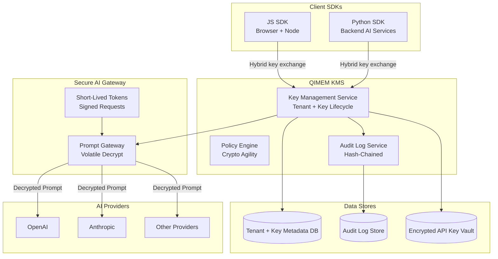

# QIMEM Architecture: End-to-End Encryption Infrastructure

## Goals

QIMEM provides a drop-in, production-grade encryption layer for AI startups that must protect sensitive data end-to-end. The design prioritizes tenant isolation, envelope encryption, post-quantum readiness, and zero-trust access controls.

## 3-Layer System

### Layer 1 — Client SDKs

**Responsibilities**
- Tenant key generation and local key handling.
- Client-side encryption before AI calls.
- Envelope encryption and key wrapping.
- Hybrid key exchange: X25519 + Kyber1024.
- Deterministic encryption option for vector search workflows.

**Design**
- The SDK hides cryptographic complexity behind safe APIs.
- No direct raw HTTP crypto calls from app code.

### Layer 2 — QIMEM KMS (Core Service)

**Responsibilities**
- Tenant provisioning and lifecycle management.
- Envelope encryption: root key → tenant master key → data encryption key (DEK).
- Key wrapping/unwrapping, rotation, revocation.
- Policy-based crypto agility.
- Audit logging with hash-chained integrity.

**Key Hierarchy**
- Root Key (per environment) encrypts Tenant Master Keys.
- Tenant Master Keys encrypt Data Encryption Keys.
- Data Encryption Keys encrypt payloads.

### Layer 3 — Secure AI Gateway

**Responsibilities**
- Accepts encrypted prompts and context payloads.
- Decrypts in volatile memory only (zeroization enforced).
- Forwards plaintext to AI providers.
- Validates signed requests and short-lived access tokens.
- Emits decrypt audit logs with tenant scoping.

**Deployment Hardening**
- Designed for enclave-based execution (Nitro Enclave or similar).
- Support for attestation-based policy enforcement.

## Envelope Encryption Flow

1. SDK derives a DEK locally.
2. SDK requests KMS to wrap the DEK using the tenant master key.
3. SDK encrypts payload locally with the DEK.
4. Encrypted payload + wrapped DEK are stored or sent to gateway.
5. Gateway unwraps DEK via KMS, decrypts in memory only, and forwards.

## Post-Quantum Hybrid Handshake

- **X25519** provides classical ECDH.
- **Kyber1024** provides post-quantum key encapsulation.
- Session keys are derived by combining both outputs using HKDF.
- Algorithm selection is policy-driven with versioned metadata.

## Vector Database Integration Overview

- Client encrypts documents with DEK.
- Embeddings are generated either on-device or within the secure gateway.
- Storage options:
  - Encrypted documents stored in a data store.
  - Embeddings can be stored as plaintext or encrypted deterministically depending on search requirements.

## Security Boundaries

- KMS never stores plaintext keys, only wrapped key material.
- Gateway never persistently stores plaintext prompts or responses.
- Tenant boundaries are enforced at the API and data layers.
